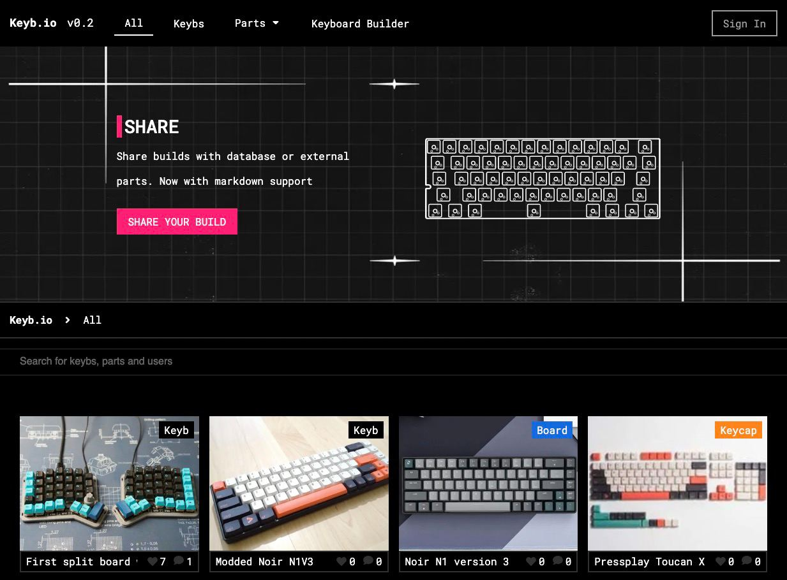
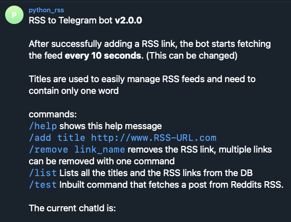

I'm a full stack javascript developer with over 4 years of experience developing software for the web, desktop, server and mobile.

Most of my public work on GitHub is on personal side projects.

# ✍ Recent Side Projects

## *️⃣  [Keyb.io](https://keyb.io) for keyboard enthusiasts

_Wiki and Social media platform for keyboard enthusiasts and collectors._

Keyb.io is a wiki and social media platform designed around the niche hobby of custom keyboard building. Designed and developed for both desktop and for tablets/phones.

The site allows users to search, submit and filter keyboard builds based on parts. Parts are customizable and users can create virtual builds.

Keyb.io is built with Typescript, React (nextjs), Node.js (nestjs), MongoDB and Keycloak. Hosted on a lightweight portainer instance, highly secure and fast because it leverages server side rendering, [loading time and SEO optimized](https://datastudio.google.com/reporting/9308fee1-3e8e-4035-8018-c119ff5a9eef) for Google Lighthouse.

## 💬 [RSS-to-telegram](https://github.com/BoKKeR/RSS-to-Telegram-Bot)

_Leading telegram bot solution designed to fetch news instantly._

An open source, community supported project based around the telegraf telegram library, RSSTT provides RSS feeds to telegram users in readable format. 

It has grown to support hundreds of users and a wide range of channels as a [publicly hosted bot](https://t.me/rss_t_bot) and has a following in the self-hosted community.  

Originally developed in python, it has since been ported to TypeScript using nestjs and sqlite library with migrations managed by prisma. It can be deployed as a multi user docker container.

This project has inspired multiple forks with different niche utilities.

## 🛠 [Thumba](https://github.com/BoKKeR/thumba)

_Self-hosted web tool to help create thumbnails from the web._

Designed to fill a gap in tooling for custom media, by providing a simple yet reliable method for generating thumbnails with out of the box support for checking multiple web results and generating thumbnails.

This tool is useful for any media but especially useful for media that is not indexed anywhere else, it can have a significant impact for hobby archivists.

Written in Typescript, React (nextjs) leveraging node on the server side, Google custom search api for searching and thum.io for generating thumbnails. 